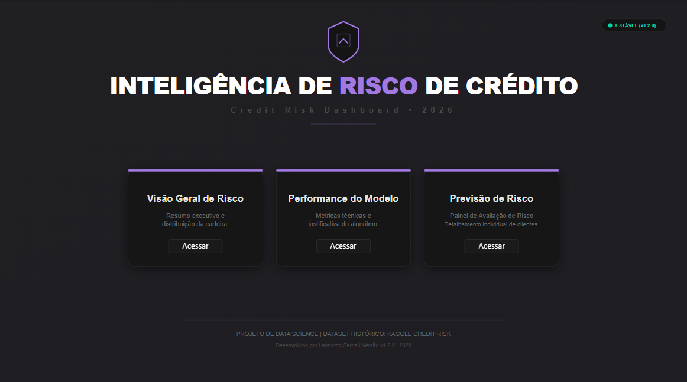
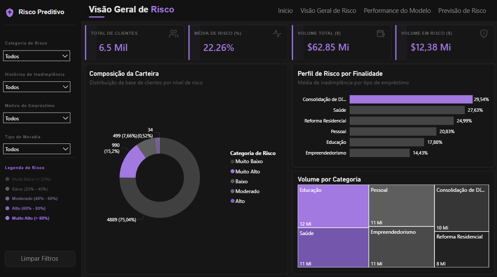
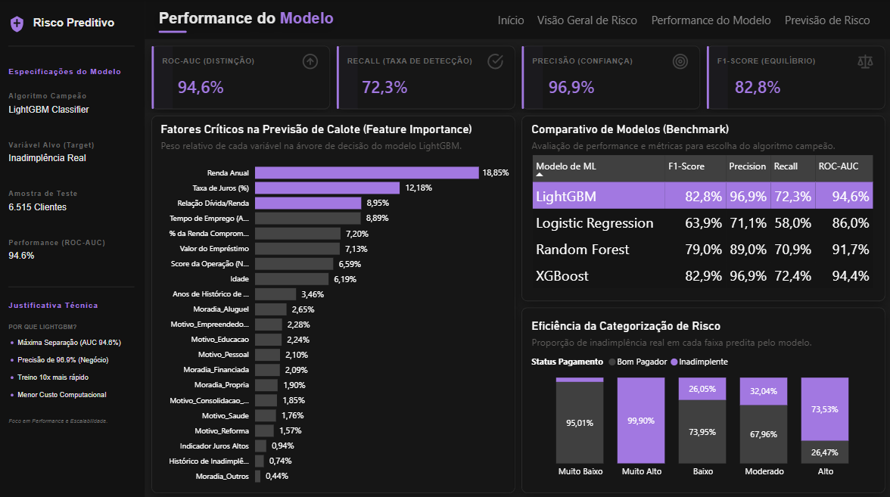
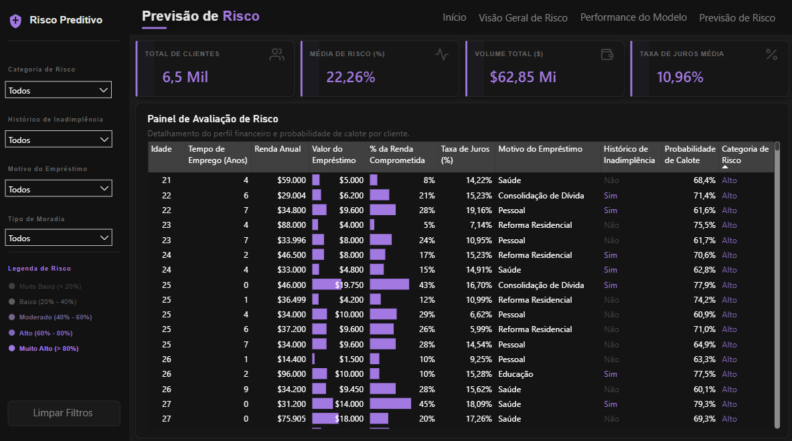
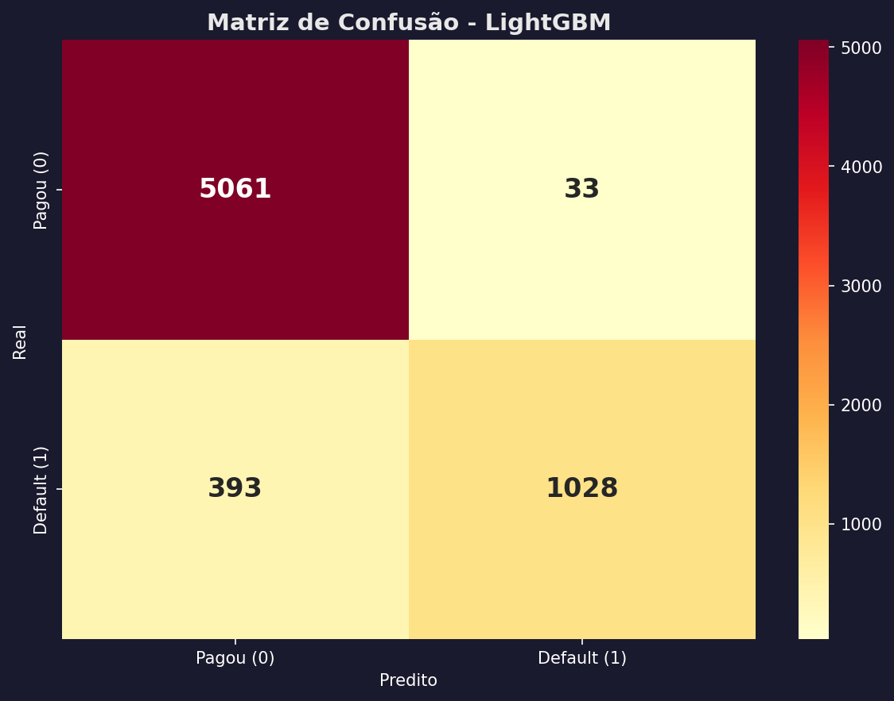
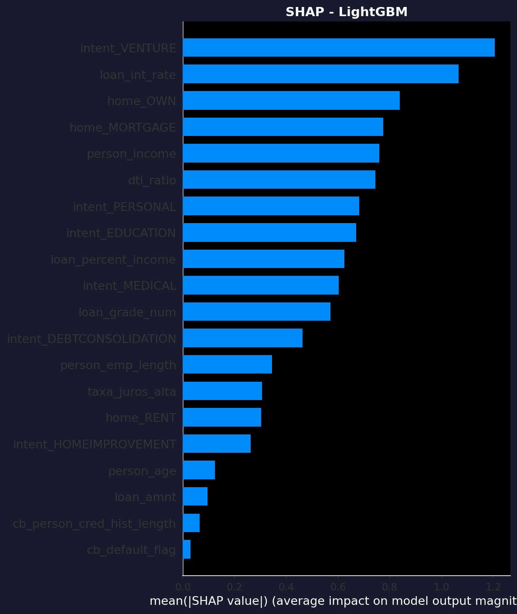
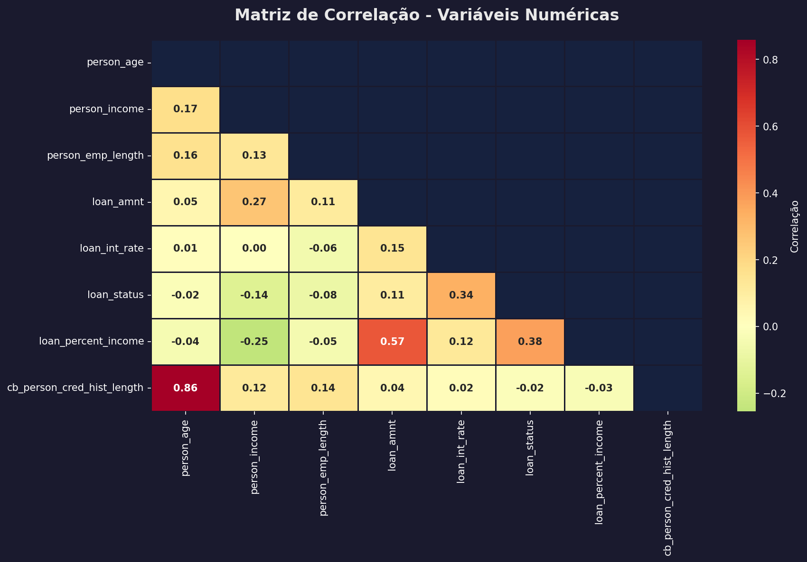

# 📊 Predictive Credit Scoring Dashboard

[**Português**](#-predictive-credit-scoring-dashboard-versão-em-português) | [**English**](#-predictive-credit-scoring-dashboard-english-version)

---

# 📊 Predictive Credit Scoring Dashboard (Versão em Português)


Este projeto apresenta o **Predictive Credit Scoring Dashboard**, uma solução completa que integra um motor preditivo de **Risco de Crédito** baseado no **Credit Risk Dataset (Kaggle)** com visualizações analíticas de alta fidelidade no Power BI.

O objetivo principal é classificar novos solicitantes de empréstimo em faixas de risco de forma automatizada, fornecendo suporte estratégico para a tomada de decisão de crédito.

## 📌 Sumário
- [📂 Fonte de Dados](#-fonte-de-dados)
- [🚀 Destaques do Projeto](#-destaques-do-projeto)
- [📂 Estrutura do Projeto](#-estrutura-do-projeto)
- [🛠️ Guia de Uso](#️-guia-de-uso)
  - [📊 1. Visualização Direta](#-1-visualização-direta-recrutadores-e-gestores)
  - [🐍 2. Reprodutibilidade Técnica](#-2-reprodutibilidade-técnica-desenvolvedores)
- [📈 Resultados Obtidos](#-resultados-obtidos)
- [🖼️ Visualização do Dashboard](#️-visualização-do-dashboard)
  - [1. Menu de Navegação](#1-menu-de-navegação-início)
  - [2. Visão Geral de Risco](#2-visão-geral-de-risco)
  - [3. Performance do Modelo](#3-performance-do-modelo)
  - [4. Previsão de Risco](#4-previsão-de-risco)
- [🔬 Validação Técnica](#-validação-técnica)

<sub>🔗 **Acesse o Dashboard Interativo:** [Clique aqui para visualizar](https://app.powerbi.com/view?r=eyJrIjoiZGU3MjRiYzktMzBkZS00NmE0LWI4MmYtNGJiZmQyOWFkZDViIiwidCI6IjI4NDVhN2ExLWQ3ZTMtNDBjNC1hMGYwLWY4NWI5OWY2Mjc2YyJ9)</sub>

## 📂 Fonte de Dados
Os dados utilizados neste projeto foram extraídos do Kaggle:
- **Dataset:** [Credit Risk Dataset](https://www.kaggle.com/datasets/laotse/credit-risk-dataset?hl=pt-BR)

## 🚀 Destaques do Projeto
- **Melhor Modelo:** LightGBM (Gradient Boosting Machine).
- **ROC-AUC:** 0.9456 (Excelente poder de separação).
- **Precisão:** 96.89% (Alta confiança na negação de crédito).
- **Explicabilidade:** Utilização de **SHAP Values** para entender o impacto de cada variável no risco.

## 🖼️ Visualização do Dashboard

Aqui estão os templates de alta fidelidade desenvolvidos para este projeto:

### 1. Menu de Navegação (Início)
O ponto de entrada do sistema, projetado para facilitar o acesso rápido aos diferentes módulos de análise.


---

### 2. Visão Geral de Risco
Monitoramento estratégico da carteira com 4 KPIs principais (Total de Clientes, Média de Risco, Volume Total e Volume em Risco), além de análises de composição por nível de risco (Donut), perfil de risco por finalidade (Barras) e volume financeiro por categoria (Treemap). Inclui também uma barra lateral com filtros e legenda de risco.


---

### 3. Performance do Modelo
Análise técnica da precisão do motor preditivo com KPIs de ROC-AUC (Distinção), Recall (Taxa de Detecção), Precisão (Confiança) e F1-Score (Equilíbrio). A página detalha os Fatores Críticos na Previsão de Calote (Feature Importance), o Comparativo de Modelos (Benchmark) e a Eficiência da Categorização de Risco. Inclui uma ficha técnica com as especificações do modelo e a justificativa para a escolha do algoritmo LightGBM Classifier.


---

### 4. Previsão de Risco
Interface operacional para análise detalhada e suporte à decisão, apresentando o Painel de Avaliação de Risco com perfil financeiro completo e probabilidade de inadimplência individualizada por cliente. Inclui 4 KPIs estratégicos (Total de Clientes, Risco Médio, Volume Total e Taxa de Juros Média). Inclui também barra lateral de filtros e legenda de risco.


## 🛠️ Tecnologias Utilizadas
- **Python 3.10+**
- **Pandas & Numpy:** Manipulação de dados e Feature Engineering.
- **Scikit-Learn:** Modelagem e métricas.
- **XGBoost & LightGBM:** Algoritmos de alto desempenho.
- **Imbalanced-Learn (SMOTE):** Balanceamento de classes.
- **SHAP:** Interpretabilidade de modelos.
- **Power BI:** Visualização e Dashboard.

## 📂 Estrutura do Projeto
```text
├── assets/             # Capturas de tela e recursos visuais do dashboard
├── data/
│   ├── raw/            # Dataset original (Credit Risk Dataset)
│   └── processed/      # Dataset limpo e Predições finais para Power BI
├── models/             # Modelos treinados (.pkl) e Scaler
├── notebooks/          # Scripts para treinamento em nuvem (Google Colab)
├── src/                # Código fonte de limpeza e engenharia de features
├── dashboard/          # Projeto do Power BI (Dashboard_Risco_Credito.pbip)
├── template_powerbi/   # Gerador de template SVG e background do dashboard
├── requirements.txt    # Dependências do projeto
└── README.md           # Documentação
```

## 🛠️ Guia de Uso

### 📊 1. Visualização Direta (Recrutadores e Gestores)
Para explorar os resultados e a interface interativa de negócio:
*   **Acesso Online:** Utilize o [Link Interativo](https://app.powerbi.com/view?r=eyJrIjoiZGU3MjRiYzktMzBkZS00NmE0LWI4MmYtNGJiZmQyOWFkZDViIiwidCI6IjI4NDVhN2ExLWQ3ZTMtNDBjNC1hMGYwLWY4NWI5OWY2Mjc2YyJ9) no topo deste documento.
*   **Acesso Local:** Abra o arquivo `Dashboard_Risco_Credito.pbip` na pasta `/dashboard` utilizando o **Power BI Desktop**.

### 🐍 2. Reprodutibilidade Técnica (Desenvolvedores)
Para executar o pipeline de dados e treinar o modelo do zero:
1.  **Ambiente:** Instale as dependências com `pip install -r requirements.txt`.
2.  **ETL:** Execute `python src/01_eda_e_limpeza.py` para limpeza e EDA.
3.  **Machine Learning:** Execute `python notebooks/02_modelagem_colab.py` para o treinamento.
4.  **Integração:** Execute `python src/ajuste_powerbi.py` para preparar os dados para o BI.

## 📈 Resultados Obtidos
O modelo final (LightGBM) demonstrou um equilíbrio superior entre precisão e sensibilidade:
- **Precision:** 0.9689 (Mínimo de falsos positivos).
- **Recall:** 0.7234 (Identifica a maioria dos potenciais calotes).
- **F1-Score:** 0.8284.

As variáveis mais importantes para o modelo foram a **Taxa de Juros**, o **Grau do Empréstimo** e a **Renda Anual**.

### 🔬 Validação Técnica
Para garantir a confiabilidade do motor preditivo, foram realizadas validações estatísticas avançadas:

| Matriz de Confusão | Explicabilidade (SHAP) |
| :---: | :---: |
|  |  |
| *Avaliação de acertos e erros (Default vs Bom Pagador)* | *Contribuição de cada variável para o risco* |

> 💡 **Nota Técnica:** Também realizamos uma análise exploratória profunda, incluindo o **Mapa de Correlação** das variáveis financeiras:
> 

---
*Este projeto foi desenvolvido como parte de um portfólio profissional de Data Science focado no setor financeiro.*

<br>

---

# 📊 Predictive Credit Scoring Dashboard (English Version)


This project presents the **Predictive Credit Scoring Dashboard**, a comprehensive solution that integrates a **Credit Risk** predictive engine based on the **Credit Risk Dataset (Kaggle)** with high-fidelity analytical visualizations in Power BI.

The main objective is to classify new loan applicants into risk tiers in an automated way, providing strategic support for credit decision-making.

## 📌 Summary
- [📂 Data Source](#-data-source)
- [🚀 Project Highlights](#-project-highlights)
- [📂 Project Structure](#-project-structure)
- [🛠️ User Guide](#️-user-guide)
  - [📊 1. Direct Visualization](#-1-direct-visualization-recruiters-and-managers)
  - [🐍 2. Technical Reproducibility](#-2-technical-reproducibility-developers)
- [📈 Results Obtained](#-results-obtained)
- [🖼️ Dashboard Visualization](#️-dashboard-visualization)
  - [1. Navigation Menu](#1-navigation-menu-home)
  - [2. Risk Overview](#2-risk-overview)
  - [3. Model Performance](#3-model-performance)
  - [4. Risk Prediction](#4-risk-prediction)
- [🔬 Technical Validation](#-technical-validation)

<sub>🔗 **Access the Interactive Dashboard:** [Click here to view](https://app.powerbi.com/view?r=eyJrIjoiZGU3MjRiYzktMzBkZS00NmE0LWI4MmYtNGJiZmQyOWFkZDViIiwidCI6IjI4NDVhN2ExLWQ3ZTMtNDBjNC1hMGYwLWY4NWI5OWY2Mjc2YyJ9)</sub>

## 📂 Data Source
The data used in this project was sourced from Kaggle:
- **Dataset:** [Credit Risk Dataset](https://www.kaggle.com/datasets/laotse/credit-risk-dataset?hl=pt-BR)

## 🚀 Project Highlights
- **Best Model:** LightGBM (Gradient Boosting Machine).
- **ROC-AUC:** 0.9456 (Excellent separation power).
- **Precision:** 96.89% (High confidence in credit denial).
- **Explainability:** Use of **SHAP Values** to understand the impact of each variable on risk.

## 🖼️ Dashboard Visualization

Here are the high-fidelity templates developed for this project:

### 1. Navigation Menu (Home)
The system's entry point, designed to facilitate quick access to different analysis modules.


---

### 2. Risk Overview
Strategic portfolio monitoring with 4 main KPIs (Total Customers, Average Risk, Total Volume, and Volume at Risk), plus composition analysis by risk level (Donut), risk profile by purpose (Bars), and financial volume by category (Treemap). Also includes a sidebar with filters and risk legend.


---

### 3. Model Performance
Technical analysis of the predictive engine's accuracy with ROC-AUC (Distinction), Recall (Detection Rate), Precision (Confidence), and F1-Score (Balance) KPIs. The page details the Critical Factors in Default Prediction (Feature Importance), Model Comparison (Benchmark), and Risk Categorization Efficiency. Includes a technical sheet with model specifications and the rationale for choosing the LightGBM Classifier algorithm.


---

### 4. Risk Prediction
Operational interface for detailed analysis and decision support, featuring the Risk Assessment Panel with a complete financial profile and individualized default probability per customer. Includes 4 strategic KPIs (Total Customers, Average Risk, Total Volume, and Average Interest Rate). Also includes a sidebar with filters and risk legend.


## 🛠️ Technologies Used
- **Python 3.10+**
- **Pandas & Numpy:** Data manipulation and Feature Engineering.
- **Scikit-Learn:** Modeling and metrics.
- **XGBoost & LightGBM:** High-performance algorithms.
- **Imbalanced-Learn (SMOTE):** Class balancing.
- **SHAP:** Model interpretability.
- **Power BI:** Visualization and Dashboard.

## 📂 Project Structure
```text
├── assets/             # Dashboard screenshots and visual resources
├── data/
│   ├── raw/            # Original dataset (Credit Risk Dataset)
│   └── processed/      # Clean dataset and Final predictions for Power BI
├── models/             # Trained models (.pkl) and Scaler
├── notebooks/          # Scripts for cloud training (Google Colab)
├── src/                # Cleaning and feature engineering source code
├── dashboard/          # Power BI Project (Dashboard_Risco_Credito.pbip)
├── template_powerbi/   # SVG template generator and dashboard background
├── requirements.txt    # Project dependencies
└── README.md           # Documentation
```

## 🛠️ User Guide

### 📊 1. Direct Visualization (Recruiters and Managers)
To explore the results and the interactive business interface:
*   **Online Access:** Use the [Interactive Link](https://app.powerbi.com/view?r=eyJrIjoiZGU3MjRiYzktMzBkZS00NmE0LWI4MmYtNGJiZmQyOWFkZDViIiwidCI6IjI4NDVhN2ExLWQ3ZTMtNDBjNC1hMGYwLWY4NWI5OWY2Mjc2YyJ9) at the top of this document.
*   **Local Access:** Open the `Dashboard_Risco_Credito.pbip` file in the `/dashboard` folder using **Power BI Desktop**.

### 🐍 2. Technical Reproducibility (Developers)
To run the data pipeline and train the model from scratch:
1.  **Environment:** Install dependencies with `pip install -r requirements.txt`.
2.  **ETL:** Run `python src/01_eda_e_limpeza.py` for cleaning and EDA.
3.  **Machine Learning:** Run `python notebooks/02_modelagem_colab.py` for training.
4.  **Integration:** Run `python src/ajuste_powerbi.py` to prepare the data for BI.

## 📈 Results Obtained
The final model (LightGBM) demonstrated a superior balance between precision and sensitivity:
- **Precision:** 0.9689 (Minimum false positives).
- **Recall:** 0.7234 (Identifies most potential defaults).
- **F1-Score:** 0.8284.

The most important variables for the model were **Interest Rate**, **Loan Grade**, and **Annual Income**.

### 🔬 Technical Validation
To ensure the reliability of the predictive engine, advanced statistical validations were performed:

| Confusion Matrix | Explainability (SHAP) |
| :---: | :---: |
|  |  |
| *Evaluation of hits and misses (Default vs Good Payer)* | *Contribution of each variable to risk* |

> 💡 **Technical Note:** We also performed a deep exploratory analysis, including the **Correlation Map** of financial variables:
> 

---
*This project was developed as part of a professional Data Science portfolio focused on the financial sector.*
